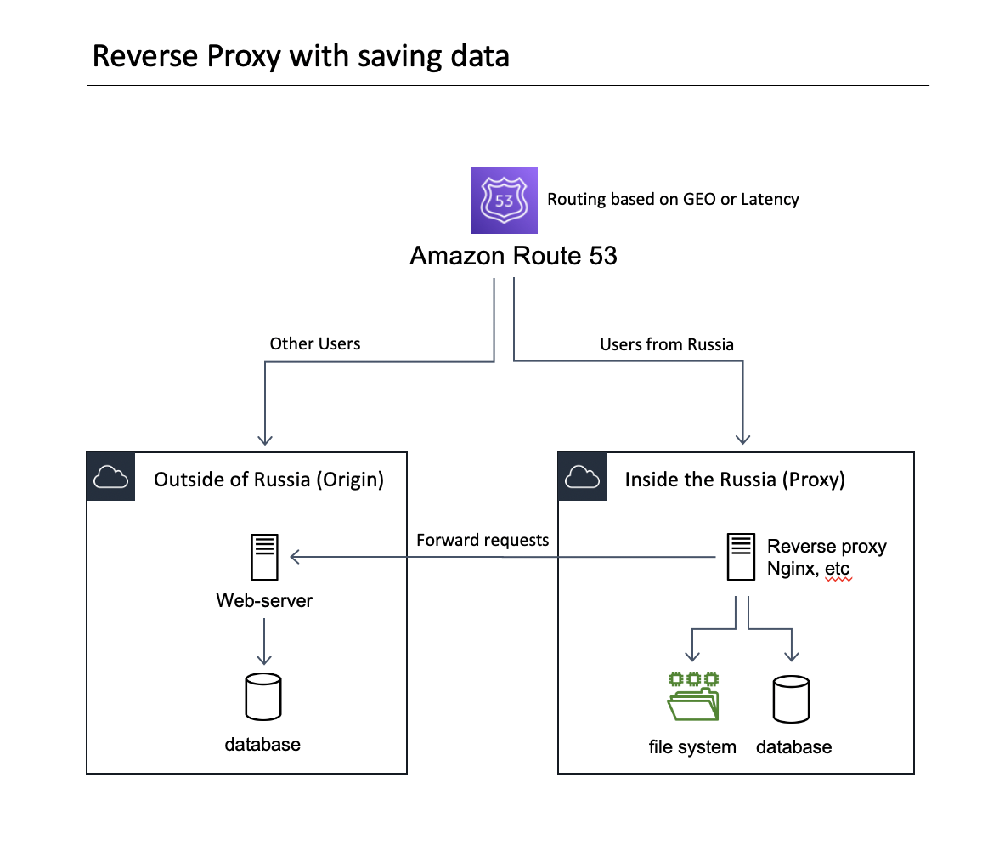
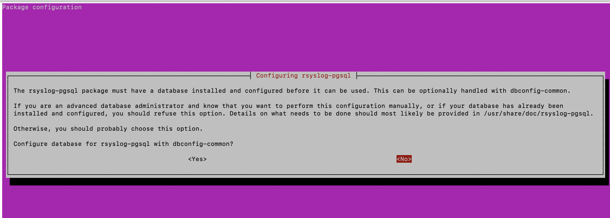

# FZ-152-Reverse-Proxy
That example will help you setup reverse proxy to catch private data and dump it in local database. This easy to go solution could make your web-service or web-site compliant with Federal Law FZ-152

## How it works
The Russiamn Federal Law 152-FZ said that data should be collected and other operations in Russia using databases during <b><u>ingestion</u></b>. <a href='http://www.consultant.ru/document/cons_doc_LAW_61801/cbf4e15b7c330f9372e876cdf2bc928bad7950ef/'>Here a link to that law. </a>

Therefore we just need collect, update and keep it up-to-date in database located in Russia. There is no requarements to format and structure of that data. Based on these assumptions we could create proxy service between client (mobile app, app, web browser) and backend server (web-site, API and etc) that will catch incomping data and save it to local database. Below you can find the architecture diagram of that scenario. 

1. Route53 or any other DNS management system could route user requests based on thier geo. In our case users from Russia should be routed at first step to our Proxy server.
2. Save that data to local file system and to local PostgreSQL database
3. Then forward traffic to origin destination url, get reposnse and return it to the end user.

For the end user that would be a transperent mechanism and you dont need change anything on thier end. To make it fully transperent you should own and have access to change A - records in your DNS name to add our proxy server for Russian users.

## Installation
0. Create virtual machine and make it available to internet, 
1. Setup DNS to that machine to get SSL certificate from let's encrypt. You will need to crete A - record and point it to ip adress to newlly created VM.
1. SSH to VM and execute 'git clone' 
2. Make the script executable 'chmod +x install.sh'
3. Run script 'sudo ./install.sh <incoming_domain> <url_to_forward_traffic>'
example: 'sudo ./install.sh example.com http://example.com' where <incoming_domain> is facade DNS name for that virtual machine and <url_to_forward_traffic> is destination for the traffic. It should automatically install all dependencies and configure on behalf of you all components. You will need to answer "No" on that screen 
4. That's all. Now all traffic would be forwarded through that virtual machine and also all POST, DELETE, PUT requests will be saved in logs and in database: proxy_logs in table: accesslog. 

## Thanks to these guides:
* nginx reverse proxy - https://www.scaleway.com/en/docs/how-to-configure-nginx-reverse-proxy/ 
* saving logs to PostgreSQL - https://www.shubhamdipt.com/blog/send-nginx-logs-to-sql-database/